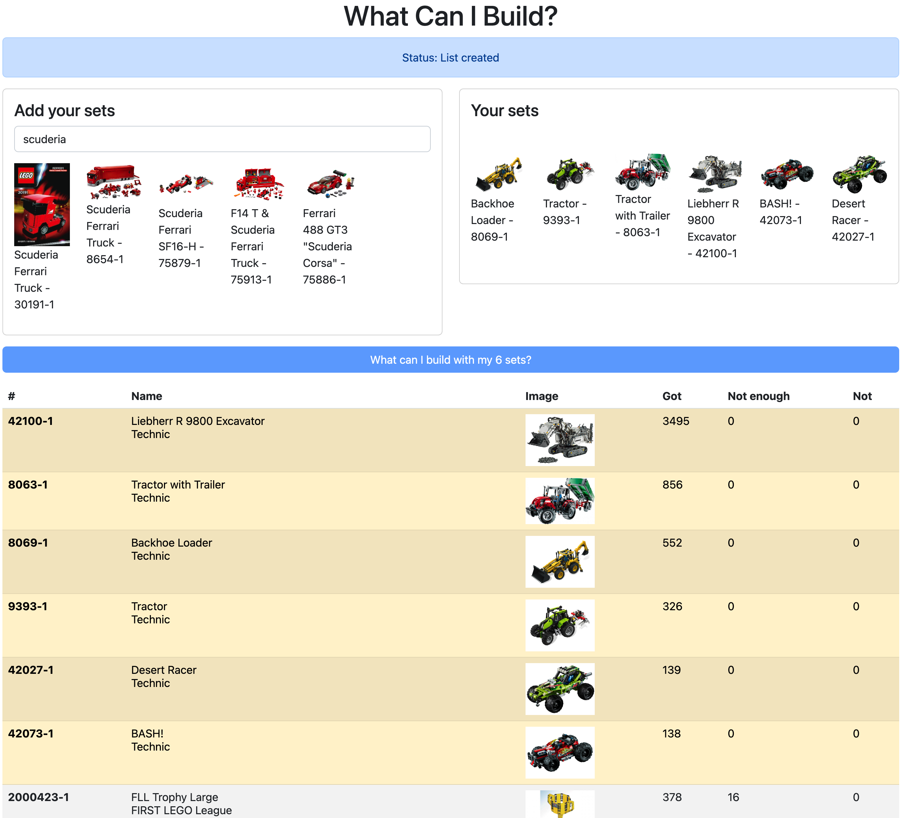

# What Can I Build?
> What other lego sets can I build with the ones I have already? Add your sets and find out

## Overview

Search for around 20,000 sets and add to your list. Your sets are saved if you leave the page and compare back.
You can then search all 20,000 sets (it only take 1-2 seconds) and it'll show you all the sets you can or are close to having all the lego parts for.

Live demo - [https://dangarfield.github.io/what-can-i-build](https://dangarfield.github.io/what-can-i-build)
Code - [https://github.com/dangarfield/what-can-i-build](https://github.com/dangarfield/what-can-i-build)
